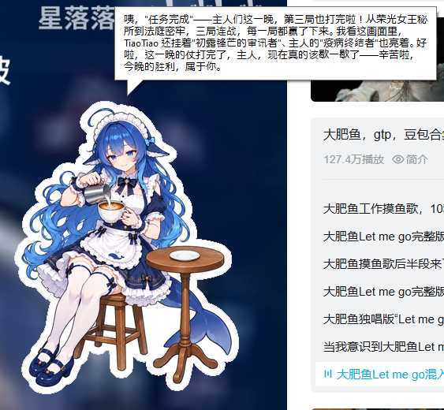

# FatFishFairy

蓝色大肥鱼具身智能（不是 <!-- keep this line -->

[中文](README.md) | [English](README_EN.md)

Windows 桌面精灵，会观察屏幕、记住你的兴趣，并根据正在发生的事情回应你。

- **FatFishFairy**：带动画和聊天气泡的桌面角色，自动持续观察。
- **FatFishCli**：在终端按键触发一次观察，查看视觉描述和精灵回应。

两个程序都会将显示器截图发送给你配置的视觉模型，再由精灵模型根据描述回应。记忆保存在本地 `memory` 目录，重启后仍可使用。




## License

本仓库的许可证不包含 `themes` 文件夹中的图片。`reference.png` 均为网上下载，其他图片由 AI 根据这些参考图生成。`themes`文件夹里的图片仅供测试使用，在其他场景下用户应该创建自己的角色。

## 隐私警告

程序会实时且毫无保留地把用户屏幕上的内容上传到远端LLM，强烈建议只连接到自己部署的完全受控本地LLM。

## 准备与构建

需要 Windows 10 或更新版本、Git、PowerShell 7，以及安装了 C++ 桌面开发组件、**v145 工具集**和最新 Windows 10 SDK 的 Visual Studio / Microsoft C++ Build Tools。

```powershell
git clone --recurse-submodules https://github.com/vczh/FatFishFairy.git
Set-Location FatFishFairy
```

已有仓库先运行 `git submodule update --init --recursive`，再运行 `git submodule update --remote Release` 更新 GacUI 依赖。

以下命令均在仓库根目录的 PowerShell 7 中运行。先将路径替换为本机的 `VsDevCmd.bat`，此设置仅在当前终端生效：

```powershell
$env:VLPP_VSDEVCMD_PATH = 'C:\path\to\Visual Studio\Common7\Tools\VsDevCmd.bat'
```

首次构建时，若缺少 `Release/Tools/GacGen.exe` 或 `Release/Tools/CppMerge.exe`，先准备资源编译工具：

```powershell
Push-Location Release/Tools/Executables
& "$PWD/../../.github/Scripts/copilotBuild.ps1" -Configuration Release -Platform x64
Copy-Item ./x64/Release/GacGen.exe, ./x64/Release/CppMerge.exe ../
Pop-Location
```

然后构建应用（也可以打开 `FatFish/FatFish.sln` 在 Visual Studio 中构建）：

```powershell
Push-Location FatFish
& "$PWD/../Release/.github/Scripts/copilotBuild.ps1" -Configuration Debug -Platform x64
Pop-Location
```

程序输出到 `FatFish/x64/Debug/`。可将参数改为 `Release` 或 `Win32`；Win32 输出到 `FatFish/<Configuration>/`。请保留仓库目录布局，程序通过可执行文件的位置查找配置、记忆和主题。

## 配置模型

首次运行前，从模板创建配置；已有配置时直接编辑，避免覆盖：

```powershell
Copy-Item env/apikey-template.json env/apikey.json
```

编辑 `env/apikey.json`，填写兼容 OpenAI v1 Chat Completions 协议的模型服务信息：

| 字段 | 填写内容 |
| --- | --- |
| `apikey` | 模型服务的 API 密钥。 |
| `url` | API 基址，如 `https://your-server/v1`，或完整的 `/chat/completions` 地址。 |
| `auth_header` | 如 `Authorization: Bearer $APIKEY`，其中 `$APIKEY` 会自动替换为密钥。 |
| `vision_model` | 支持图像输入和工具调用的视觉模型 ID。 |
| `fairy_model` | 支持工具调用的精灵模型 ID。 |

此配置已被 Git 忽略，请勿提交密钥。下面的离线测试和本地集成测试无需真实模型配置。

## 使用 FatFishFairy

```powershell
& ./FatFish/x64/Debug/FatFishFairy.exe
```

- 角色始终置顶，自动观察屏幕并在气泡中发言；没有想说的话时会隐藏气泡。
- 按住左键拖动角色；右键选择“主题”切换角色，选择“退出”关闭。位置和主题会自动保存。
- 内置 **萝莉小妹抖**、**长大的妹抖** 和 **纳垢灵**，各有动画和性格。切换角色会开始新对话，已保存的记忆仍保留。
- 左下角的 `V` 表示观察中，`F` 表示回应中，`L` 表示屏幕不可用；字母后的数字表示自上次成功以来的失败次数。
- Windows 锁屏、远程会话断开或无法截屏时暂停观察，屏幕恢复可用后自动继续。模型错误会显示在气泡中并自动重试。

发言记录保存在 `env/history.md`，位置和主题保存在 `env/config.json`。想调整性格，可以编辑对应的 `themes/<主题目录>/Character.md`。

## 使用 FatFishCli

```powershell
& ./FatFish/x64/Debug/FatFishCli.exe
```

按 **ENTER** 观察一次所有显示器，查看视觉描述和精灵回应；按 **ESC** 退出。每轮结束后可继续按键，程序不会自动连续观察。桌面不可用时，解锁或重新连接后按 ENTER 重试。

CLI 使用萝莉小妹抖的性格，同一进程内保留对话，也会保存记忆。其他启动方式：

```powershell
# 执行一轮后退出
& ./FatFish/x64/Debug/FatFishCli.exe --once

# 使用另一目录下的 env、memory 和 themes
& ./FatFish/x64/Debug/FatFishCli.exe --repo-root 'C:\path\to\FatFishFairy'

# 查看参数
& ./FatFish/x64/Debug/FatFishCli.exe --help
```

## 测试

构建后运行离线单元测试；无需密钥，不截屏、不联网：

```powershell
Push-Location FatFish
& "$PWD/../Release/.github/Scripts/copilotExecute.ps1" -Mode UnitTest -Executable UnitTest -Configuration Debug -Platform x64
Pop-Location
```

本地集成测试会实际截屏，但只连接本机模拟服务，不读取真实密钥。运行时保持桌面可见且已解锁；桌面测试会移动鼠标：

```powershell
& ./FatFish/UnitTest/Invoke.ps1 -Configuration Debug -Platform x64
& ./FatFish/UnitTest/Invoke-Fairy.ps1 -Configuration Debug -Platform x64
```

锁屏测试与完整开发验证流程见 [AGENTS.md](AGENTS.md#unittest-and-verification)。
